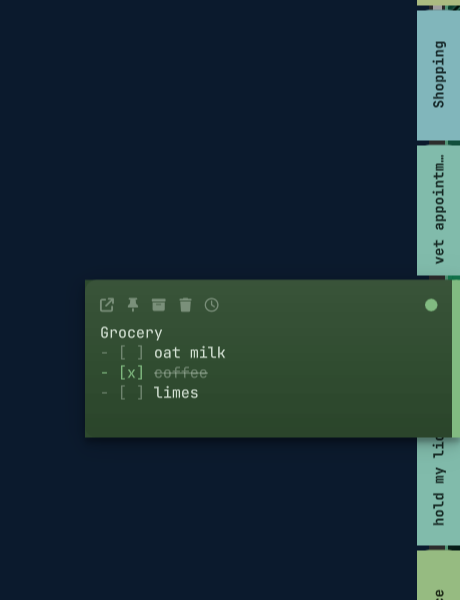

# Ledge

Sticky notes that live on the edge of your screen, for Hyprland.

Notes rest as thin coloured dashes against one edge of the display. Reach toward
them and the strip fans out to show its labels. Land on one and that dash *is*
the note: it widens, grows to fit its text, and its colour retreats to a band
down the edge. Nothing slides out from behind anything else. Move away and it
folds back to a dash.

Everything else on the surface is click-through, so the strip costs you nothing
until you reach for it.



## Why not just a window

Ledge is a `wlr-layer-shell` surface, not a floating window. That means it is a
desktop component in the same sense your bar is: it never appears in the window
list, never takes focus you did not give it, is never tiled, and does not steal
the pointer. The only parts of it that accept input are the strip itself and
whichever note is currently open. The rest of the screen behaves as if it were
not there.

## Install

```bash
yay -S ledge          # once published
systemctl --user enable --now ledge
```

From source:

```bash
git clone https://github.com/tsouth89/ledge
cd ledge
./bin/ledge start
```

Requires `quickshell` and a `wlr-layer-shell` compositor. Developed on Hyprland;
Sway, river, niri and Wayfire should work but are untested.

## Use

Reach for the edge. That is the whole interface.

| | |
|---|---|
| hover the strip | fans out, showing labels |
| hover a note | it opens |
| click | opens and puts the caret in the text |
| drag a dash | reorder; neighbours slide aside to show where it lands |
| the `+` at the end of the strip | new note |
| `SUPER + N` | new note; press it again to put the note away |
| `Esc` | save and fold away |
| scroll the strip | when there are more notes than fit |

Hovering along an already-open strip swaps straight to the next note rather than
making you wait out the dwell again.

An open note shows its controls the whole time it is open: pop out, pin,
archive, delete, and a swatch that cycles its colour. Hovering one names it.
Delete takes two clicks, and deleted notes go to `trash/` rather than being
unlinked, so a misclick is recoverable twice over.

A note you open and never type into is discarded when it closes. Nothing is
written to disk until a note has something in it, so reaching for `SUPER + N`,
thinking better of it, and pressing it again leaves nothing behind.

### Reminders

The clock on an open note sets one: 15 minutes, an hour, three hours, or next
9am. Click it again to clear it, and it lights up while one is pending.

Reminders live in the note's frontmatter, so they travel with the file. Nothing
schedules a timer per note; the list is swept periodically instead, which means
a reminder that came due while the machine was asleep, or while Ledge was not
running, still fires the next time it is looked at rather than being silently
skipped.

```bash
ledge remind <id> 90m
ledge remind <id> 2026-09-01T09:00:00Z
ledge remind <id> clear
```

### All notes

`SUPER + SHIFT + L` opens a window with every note in it: search across bodies
and titles, browse what you have archived, and go through the trash.

Deleting a note moves its file to `trash/` rather than unlinking it, and the
trash view lists what is in there with how long ago it went, so a note you
deleted by mistake is two clicks from being back. Emptying the trash is the only
thing in Ledge that destroys anything, and it asks twice.

Export writes every note into one markdown file, using each note's first line as
its heading.

### Popping a note out

Notes do not have to stay on the edge. Pop one out and it detaches to sit
anywhere on the desktop. Drag it by its header strip or its colour band, resize
it from the grip in its corner, and dock it back with one control. It leaves the
strip while it is out.

Dragging a popped-out note between monitors is handed to the compositor, the
same way a title bar does it, so crossing outputs and spanning the seam behave
exactly like every other window on your desktop. Position and size persist in
`floats.json`.

Popped-out notes are pinned, borderless, and do not take focus when they appear,
so one parked on your desktop follows you between workspaces without ever
catching a keystroke meant for something else. Ledge applies the Hyprland rules
for this itself; see [docs/hyprland.md](docs/hyprland.md) if you want to know
exactly what it sets and why.

## Command line

```
ledge start | stop | restart | status
ledge new [text]        create a note and open it (reads stdin)
ledge add [text]        append to the most recent note (reads stdin)
ledge list              every note as JSON
ledge all               open the All Notes window
ledge export [path]     write every note to one markdown file
ledge trash             list deleted notes as JSON
ledge restore <file>    bring a deleted note back
ledge open <id>         open one note for editing
ledge rm <id>           move a note to the trash
ledge move <id> <n>     move a note to position n (0 is first)
ledge pop <id>          detach a note to float on the desktop
ledge place <id> <x> <y>  move a floating note (global screen coordinates)
ledge dock <id>         send a floating note back to the strip
ledge peek              fan the strip open
ledge close             collapse it
```

So this works:

```bash
dmesg | tail -20 | ledge new
ledge add "call the vet at 3"
```

Bind it in Hyprland:

```lua
o.bind("SUPER + N", "New note", "ledge new")
o.bind("SUPER + SHIFT + L", "All notes", "ledge all")
```

`SUPER + N` is the one plain-SUPER letter Omarchy leaves free that actually
means something here, and it matches the macOS original's new-note chord.

## Your notes are just files

```
~/.local/share/ledge/
├── notes/<id>.md     one note per file, YAML frontmatter
├── order             note ids, one per line, display order
├── floats.json       positions of popped-out notes
└── trash/            deleted notes
```

```markdown
---
id: mtfb6ns2-v3ak
color: cyan
created: 2026-08-30T04:27:57.026Z
---
vet appointment
- [ ] thursday 3pm
```

Grep them, commit them, sync them, point Obsidian at them, edit them in Neovim
while Ledge is running: the strip watches the directory and picks up outside
edits live.

Neither ordering nor float position lives in the frontmatter. Dragging a note to a new spot
rewrites one small `order` file rather than touching every note below it, which
keeps reorders out of the way in git and in any file-sync tool.

Notes are plain text, and stay plain text. There is no edit/preview mode,
because a note you hover for half a second should not have modes.

Markdown is styled in place instead. Headings get weight, `**bold**` goes bold,
`*italic*` leans, `~~strike~~` strikes, backticks and links pick up the note's
colour, and a ticked `- [x]` strikes its line through. Every marker stays on
screen, dimmed, and every character stays exactly where you typed it, because
what you are editing is still the plain text underneath. Click a `- [ ]` box to
tick it.

The one real constraint: the styled layer only lines up with the text while bold
and regular share an advance width, which is true of a monospaced font and not
of a proportional one. Headings change weight and colour but never size, for the
same reason. Set `"styling": false`, or `styled: false` in one note's
frontmatter, to turn it off.

## Theming

Ledge reads the active Omarchy theme directly and recolours with it:

```
~/.local/state/omarchy/current/theme/colors.toml
~/.local/state/omarchy/current/theme/shell.toml
```

`omarchy theme set <name>` repaints the notes with no restart.

Note colours are *generated* rather than looked up, and this is deliberate.
Reading eight swatches off a theme palette by name sounds right and fails in
practice: a monochrome theme's `red`, `green` and `magenta` are all the same
hue, so every note ends up the same colour. Osaka Jade's `bright_magenta` is
`#75bbb3`, a teal. Instead Ledge takes the theme accent's hue, saturation and
lightness and spreads eight swatches across an arc centred on it. Muted themes
get muted notes, vivid themes get vivid ones, and the notes stay distinguishable
from each other in every theme. Widen or narrow the arc with `swatchSpread`.

## Configuration

`~/.config/ledge/config.json`, hot-reloaded on save. Every key is optional.
See [docs/config.md](docs/config.md).

```json
{
  "edge": "right",
  "monitor": "focused",
  "cardWidth": 300,
  "swatchSpread": 0.42
}
```

## Development

```bash
./test/smoke.sh     # drives a throwaway instance over IPC, asserts on disk state
./bin/ledge restart # reload after editing the QML
```

`LEDGE_DATA_DIR` and `LEDGE_CONFIG` override where notes and settings live,
which is how the tests stay clear of real notes.

## License

MIT
